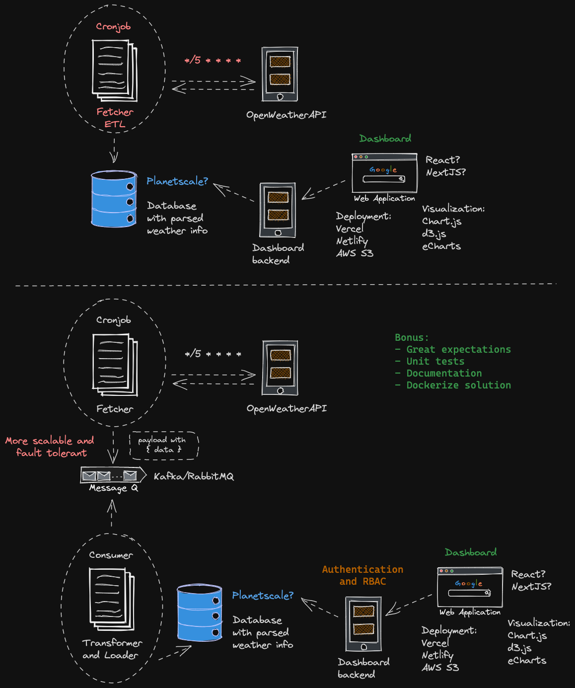

# weather-dashboard
A real-time weather dashboard

# Overview diagram



# Requirements
- Python
- Docker
- make

# Getting started
- Clone the repository
- `cd` to your cloned repo
-  In the main directory create a `.env` file based on `.env.example` with your weather api key and your database connection info. 
You can find you key [here](https://openweathermap.org/current).

You need a running instance of postgres in order to store the data.
Run `docker-compose up -d` to run a local postgres instance in the background.
- Run the script
```sh
make run
```
  
# Test
At the root folder, run this in the terminal:
```sh
make test
```
This will run all tests under the `tests/` folder.

# TODO
- [x] Validate the JSON response of openweathermap so that I have a types object after the request
- [x] Fix the pytest error
- [ ] Build UI dashboard


